# EDAISS User Manual

### Top Bar

At the top of the website, we find the connector name and a button to select the portal theme.

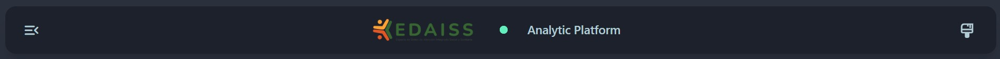

# 1. Provide Assets

## 1.1. Assets

In the top bar we can find the asset search, create asset button, how many items to show per page and pagination.

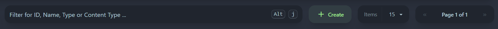

### 1.1.1. Create Asset

To create an asset, we must first go to the "Assets" tab in the side menu. In the upper right corner, we can find a button that says "+ Create". We click on the button and a modal with a form will open.

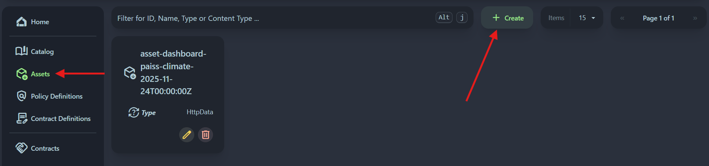

The form contains the following fields that must be filled in:

Common Fields:

- ID
- Name
- Content Type
- Description

(These fields are optional, but it is recommended to fill in the ID, Name, and Description fields.)

Next, select the "Data Address", which should be:

- Type: HttpData
- Method: GET
- Base URL: The complete URL of the API Provider.
- Then click the "Create Asset" button.

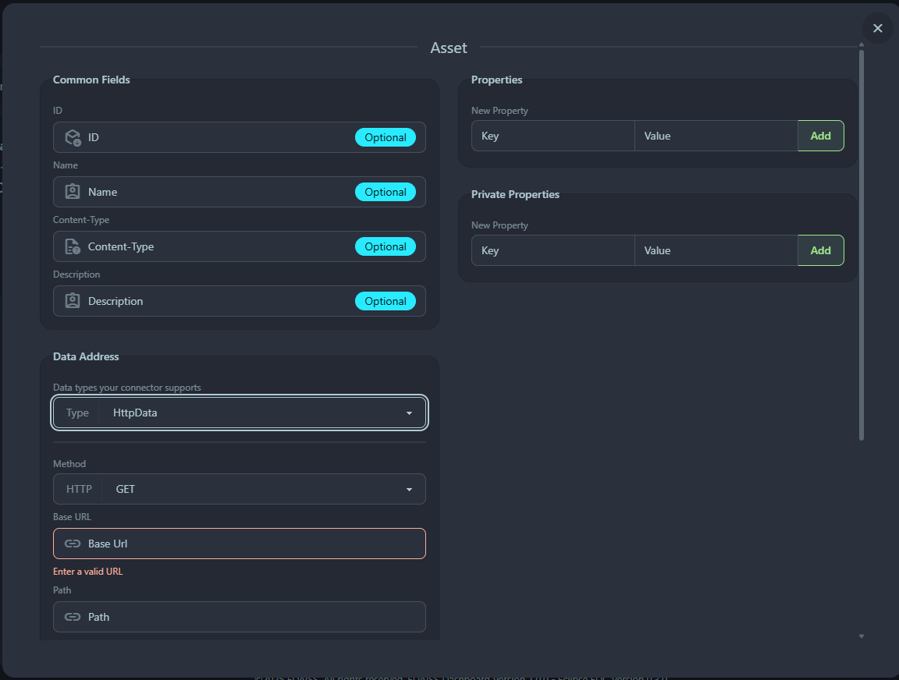

### 1.1.2. Edit Asset

On the asset card, we must click on the edit button and a modal will open with the form for editing the asset; the only non-editable field is the "ID".

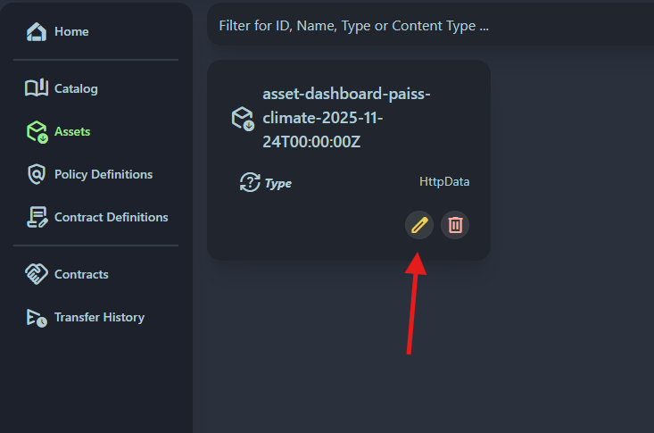

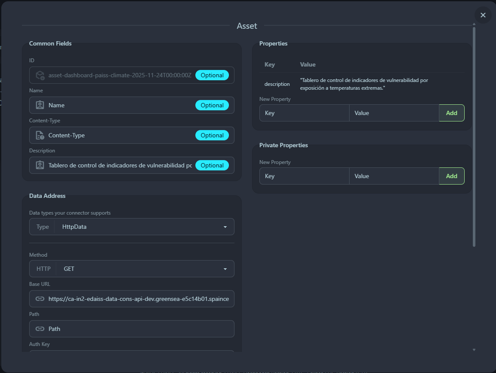

### 1.1.3. Delete Asset

On the asset card, we must click on the delete button and a modal will open asking for confirmation to delete the asset.

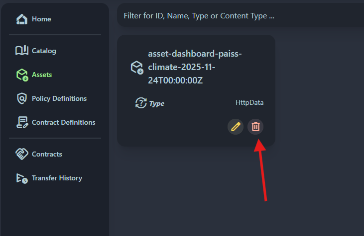

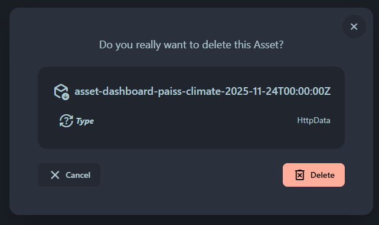

# 2. Request Assets

## 2.1. Catalog

At the catalog top bar we can find a button to request an asset manually, if you click the button a modal will open.

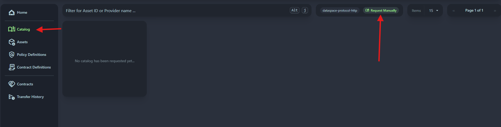

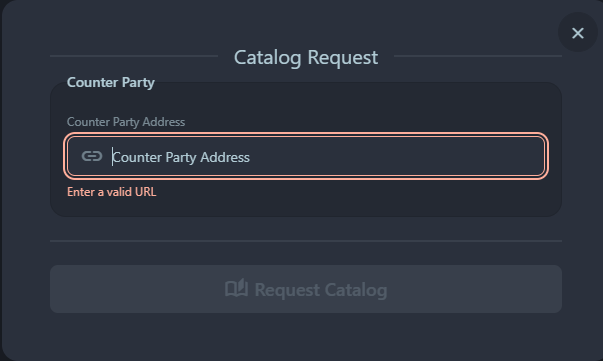

At the Counter Party Address, enter the remote connector Protocol URL to retrieve the list of available assets for negotiation.

To negotiate an asset we have to click at the "Negotiate" button at the card.

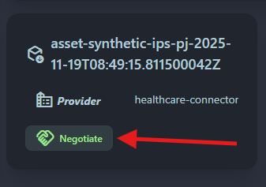

This will open a modal where we can select an offer and then click at the button "Negotiate" at the modal.

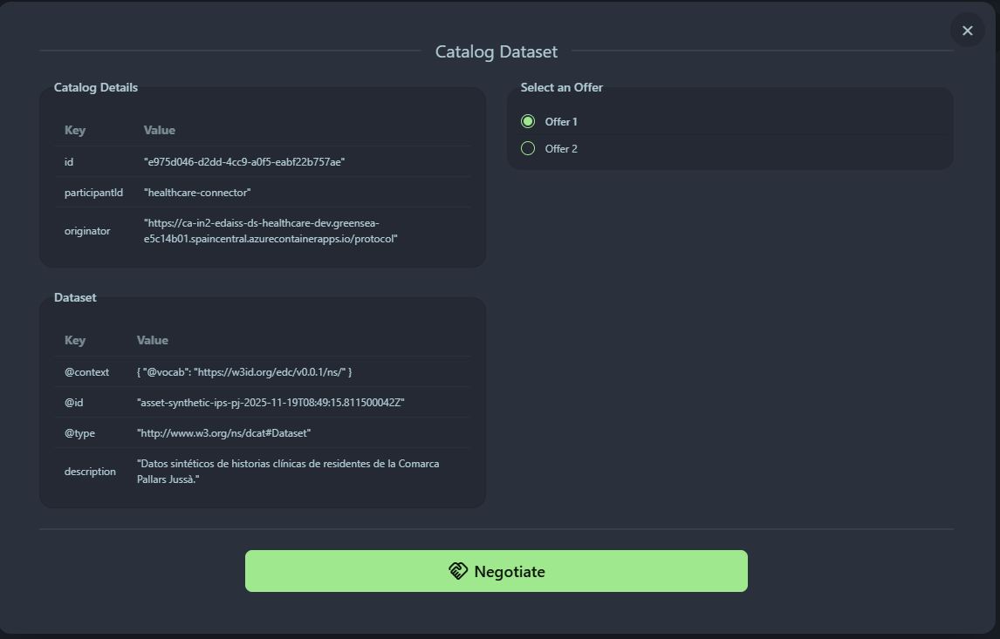

Then will open a modal with the negotiation process.

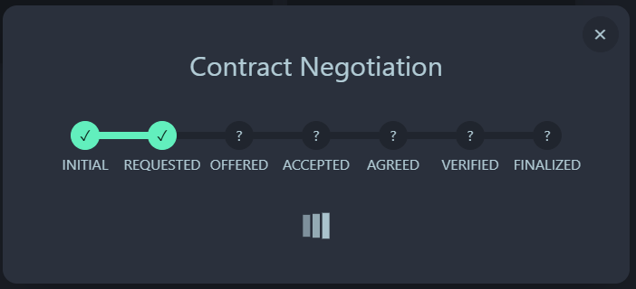

# 3. Transfer Assets

## 3.1. Contracts

In the Contracts tab, we can see the contract definitions, which define the rules and conditions under which assets can be negotiated.

At the top we can find the top bar where you can search for a contract, select if is "Consuming" or "Providing", items per page to show and pagination.

To transfer an asset, we must click on the "Transfer" button.

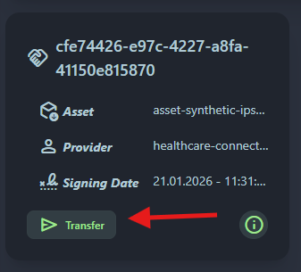

## 3.2. Transfer

Then a modal opens where we configure the data transfer parameters for the selected asset.

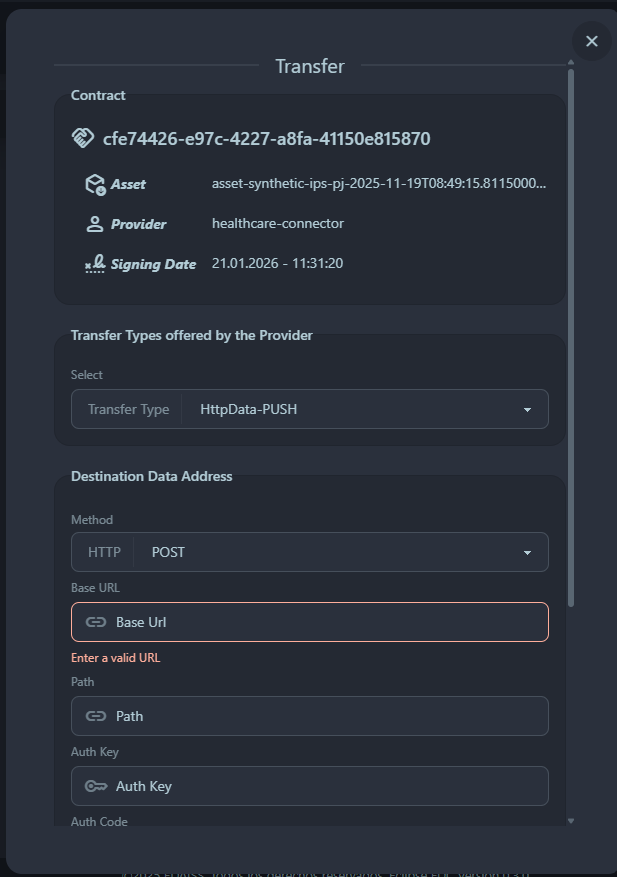

The form fields to complete are as follows:

Contract: Contract details to be transferred.

Transfer Types offered by the Provider:

- Transfer Type: HttpData-PUSH

Destination Data Address:

- Method: POST
- Base URL: The consumer-side endpoint that the provider uses to push the data as part of the data transfer.

Then we can click the "Start Transfer" button.

## 3.3. Transfer History

At the top we can find the top bar where you can search for a transfer, select if is "Consuming" or "Providing", items per page to show and pagination.

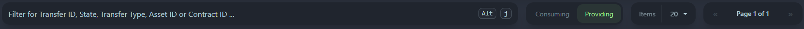

In the "Transfer History" tab, we can find the table with the list of transfers made; the form fields are as follows:

- Transfer ID
- State Changed
- State
- Transfer Type
- Asset ID
- Contract ID
- Link to the asset sent (just at the Public Health portal)
- Info and Delete buttons

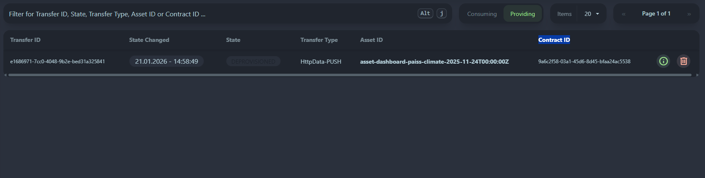
